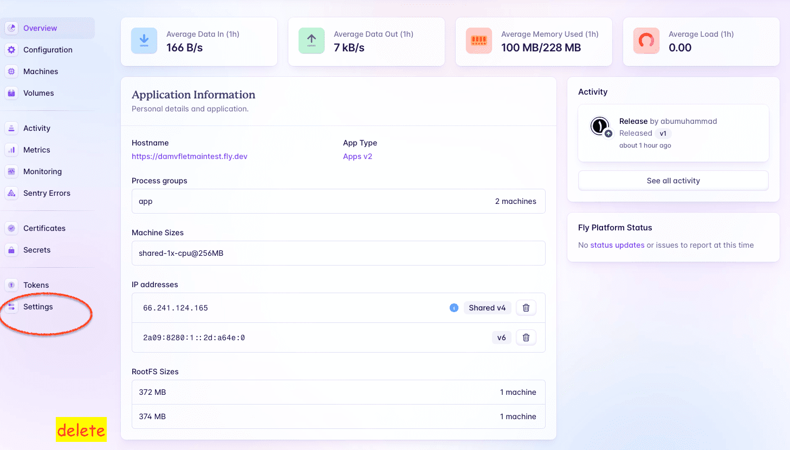

# Python : flet app hello fly.io deploy damvfletmaintest

files structure :

    ❯ tree -L 2 -I 'gambar-petunjuk|README.md'

        ├── Dockerfile
        ├── fly.toml
        ├── main.py
        └── requirements.txt

#### &#x1FAB6; code :

&#x1FAA7; Notes [enable clipboard on Vim] : 

- to select all lines in the vim editor is to press the `ggVG` key, then if you want to copy all the context, also press the `"+y` key. And if you want to paste it into the vim editor, you can do the key `"+p`.

- check 

    ❯ vim --version | grep clipboard

        +clipboard         -keymap            +printer           +vertsplit
        +eval              -mouse_jsbterm     -sun_workshop      -xterm_clipboard

- python

        ❯ vim main.py

            import flet as ft

            def main(page: ft.Page):

                appbar = ft.AppBar(
                    title = ft.Text("Flet web app", size=45, color="white"),
                    bgcolor = "blue"
                )

                page.vertical_alignment = ft.MainAxisAlignment.CENTER
                page.horizontal_alignment = ft.CrossAxisAlignment.CENTER

                content_1 = ft.Container(
                    content = ft.Column([
                        ft.Text("Hello From Flet", size=40)
                    ])
                )

                content_2 = ft.Container(
                    content = ft.Column([
                        ft.Text("by Dhony Abu Muhammad", size=20)
                    ])
                )

                page.add(appbar, content_1, content_2)

            ft.app(target=main, port=8080, view=None)

- Dockerfile 

        ❯ vim Dockerfile

            FROM python:3-alpine

            WORKDIR /app

            COPY requirements.txt ./
            RUN pip install --no-cache-dir -r requirements.txt

            COPY . .

            EXPOSE 8080

            CMD ["python", "./main.py"]

#### &#x1F525; Test application with Docker container

    ❯ docker build -t flethello .

    ❯ docker run -d --name flethello-app -p 8080:8080 flethello

    # list

    ❯ docker images

        REPOSITORY   TAG       IMAGE ID       CREATED         SIZE
        flethello    latest    c2776a18e47f   6 seconds ago   143MB

    ❯ docker ps -a --format "table {{.ID}}\t{{.Image}}\t{{.Status}}\t{{.Names}}\t{{.Ports}}"

        CONTAINER ID   IMAGE       STATUS         NAMES           PORTS
        52eb0a6dc200   flethello   Up 4 seconds   flethello-app   0.0.0.0:8080->8080/tcp
---

#### Result :

    

#### Reset containers :

    ❯ docker rm -f $(docker ps -aq) && docker rmi -f $(docker images -q)

        52eb0a6dc200
        Untagged: flethello:latest
        Deleted: sha256:c2776a18e47f8296e6d10202a08ea3cf0dbd133f3842673e816169e88d2e61bb

---

    

---

## Stages in deploying the application to fly.io

#### code :

- toml [Tom's Obvious Minimal Language]

        ❯ vim fly.toml

            app = "damvfletmaintest"

            kill_signal = "SIGINT"
            kill_timeout = 5
            processes = []

            [env]
            FLET_SERVER_PORT = "8080"

            [experimental]
            allowed_public_ports = []
            auto_rollback = true

            [[services]]
            http_checks = []
            internal_port = 8080
            processes = ["app"]
            protocol = "tcp"
            script_checks = []

            [services.concurrency]
                hard_limit = 25
                soft_limit = 20
                type = "connections"

            [[services.ports]]
                force_https = true
                handlers = ["http"]
                port = 80

            [[services.ports]]
                handlers = ["tls", "http"]
                port = 443

            [[services.tcp_checks]]
                grace_period = "1s"
                interval = "15s"
                restart_limit = 0
                timeout = "2s"

#### check version :

    ❯ flyctl version

        flyctl v0.2.15 darwin/arm64 Commit: 846630217aff135b32ec0d6a018cf6bdde0f1762 BuildDate: 2024-03-10T09:52:28Z

### &#x1F530; create Apps :

    ❯ flyctl apps create --name damvfletmaintest

        automatically selected personal organization: abumuhammad
        New app created: damvfletmaintest

check and watch for updates on the fly.io console dashboard (`https://fly.io/dashboard`)

    

### &#x1F530; deploy Apps :

    ❯ flyctl deploy

        ==> Verifying app config
        Validating /Users/.../python-flet-app-hello-fly.io-deploy-damvfletmaintest/fly.toml
        ✓ Configuration is valid
        --> Verified app config
        ==> Building image
        Remote builder fly-builder-throbbing-shadow-8193 ready
        Remote builder fly-builder-throbbing-shadow-8193 ready
        ==> Building image with Docker
        --> docker host: 20.10.12 linux x86_64
        [+] Building 31.9s (9/10)                                                                                                              
        => [internal] load build definition from Dockerfile                                                                              0.1s
        => => transferring dockerfile: 202B                                                                                              0.1s
        => [internal] load .dockerignore                                                                                                 0.1s
        => => transferring context: 2B                                                                                                   0.1s
        => [internal] load metadata for docker.io/library/python:3-alpine                                                                3.7s
        => [1/5] FROM docker.io/library/python:3-alpine@sha256:1a0501213b470de000d8432b3caab9d8de5489e9443c2cc7ccaa6b0aa5c3148e         28.2s
        => => resolve docker.io/library/python:3-alpine@sha256:1a0501213b470de000d8432b3caab9d8de5489e9443c2cc7ccaa6b0aa5c3148e          0.0s
        => => extracting sha256:4abcf20661432fb2d719aaf90656f55c287f8ca915dc1c92ec14ff61e67fbaf8                                         0.1s
        => => sha256:4abcf20661432fb2d719aaf90656f55c287f8ca915dc1c92ec14ff61e67fbaf8 3.41MB / 3.41MB                                    0.1s
        => => sha256:dca80dc46cecdd1a97787a1dd6f74263b9d2f7b0dd3e2e15c109f5e34848c932 622.15kB / 622.15kB                                0.1s
        => => sha256:fe9e15b6315c34de5c802bdbd343e3ec69bdc4ab870783fc1b9552daaef25e77 11.77MB / 11.77MB                                  1.4s
        => => sha256:a8fd6f3f484fdfccf33965ca0f8807e5078a619803cf638d82bc4a405e91de04 242B / 242B                                        1.0s
        => => sha256:4fc96b5c1ba465ba27fb55d4766ade8624de4082ac1530b3293ac735ab3ead50 2.70MB / 2.70MB                                    1.6s
        => => sha256:1a0501213b470de000d8432b3caab9d8de5489e9443c2cc7ccaa6b0aa5c3148e 1.65kB / 1.65kB                                    0.0s
        => => sha256:849ed6079c9f797ca9c1b7d6aea1c00aea3ac35110cbd0d6003f15950017ea8d 1.37kB / 1.37kB                                    0.0s
        => => sha256:c54b53ca8371c4e91a0d13c637c2c89d114b91ffa18289e93387e3e80da979f8 6.04kB / 6.04kB                                    0.0s
        => => extracting sha256:dca80dc46cecdd1a97787a1dd6f74263b9d2f7b0dd3e2e15c109f5e34848c932                                         0.1s
        => => extracting sha256:fe9e15b6315c34de5c802bdbd343e3ec69bdc4ab870783fc1b9552daaef25e77                                         0.4s
        => => extracting sha256:a8fd6f3f484fdfccf33965ca0f8807e5078a619803cf638d82bc4a405e91de04                                         0.0s
        => => extracting sha256:4fc96b5c1ba465ba27fb55d4766ade8624de4082ac1530b3293ac735ab3ead50                                         0.2s
        => [internal] load build context                                                                                                 0.3s
        => => transferring context: 266.08kB                                                                                             0.2s
        => [2/5] WORKDIR /app                                                                                                            0.1s
        => [3/5] COPY requirements.txt ./                                                                                                0.0s
        => [4/5] RUN pip install --no-cache-dir -r requirements.txt                                                                     25.1s
        => [5/5] COPY . .                                                                                                                0.0s 
        => exporting to image                                                                                                            0.7s 
        => => exporting layers                                                                                                           0.7s
        => => writing image sha256:019e94bd9498d9e0c7def52a163574081abd71c183d93e9de3c0d6f8638d1818                                      0.0s
        => => naming to registry.fly.io/damvfletmaintest:deployment-01HRRJ28FJBQ027HR125YCSV7W                                           0.0s
        --> Building image done
        ==> Pushing image to fly
        The push refers to repository [registry.fly.io/damvfletmaintest]
        4540ec53c714: Pushed 
        3b6a513fc8ed: Pushed 
        04290844c800: Pushed 
        eaaac683c25a: Pushed 
        5305019f4685: Pushed 
        d2968c01735e: Pushed 
        0c9bfb14c909: Pushed 
        678cac8b069e: Pushed 
        d4fc045c9e3a: Pushed 
        deployment-01HRRJ28FJBQ027HR125YCSV7W: digest: sha256:7d7e418d3846a9c00577dcde1cb4d40b3a851ec409073391e550b75c404ce7c7 size: 2203
        --> Pushing image done
        image: registry.fly.io/damvfletmaintest:deployment-01HRRJ28FJBQ027HR125YCSV7W
        image size: 139 MB

        Watch your deployment at https://fly.io/apps/damvfletmaintest/monitoring

        Provisioning ips for damvfletmaintest
        Dedicated ipv6: 2a09:8280:1::2d:a64e:0
        Shared ipv4: 66.241.124.165
        Add a dedicated ipv4 with: fly ips allocate-v4

        This deployment will:
        * create 2 "app" machines

        No machines in group app, launching a new machine
        Creating a second machine to increase service availability
        Finished launching new machines
        -------
        ✔ Machine 148ede5c5d4789 [app] update finished: success
        -------
        Checking DNS configuration for damvfletmaintest.fly.dev

        Visit your newly deployed app at https://damvfletmaintest.fly.dev/

check and watch for updates on the fly.io console dashboard (`https://fly.io/dashboard`)

    

### &#x1F530; check

    ❯ flyctl status

        App
        Name     = damvfletmaintest                                        
        Owner    = personal                                                
        Hostname = damvfletmaintest.fly.dev                                
        Image    = damvfletmaintest:deployment-01HRRJ28FJBQ027HR125YCSV7W  

        Machines
        PROCESS ID              VERSION REGION  STATE   ROLE    CHECKS                  LAST UPDATED         
        app     080e092c6404e8  1       sin     started         1 total, 1 passing      2024-03-12T05:29:03Z
        app     148ede5c5d4789  1       sin     started         1 total, 1 passing      2024-03-12T05:29:21Z

    ❯ flyctl ips list

        VERSION IP                      TYPE                    REGION  CREATED AT       
        v6      2a09:8280:1::2d:a64e:0  public (dedicated)      global  40m15s ago      
        v4      66.241.124.165          public (shared)                 Jan 1 0001 00:00

        Learn more about Fly.io public, private, shared and dedicated IP addresses in our docs: https://fly.io/docs/reference/services/#ip-addresses

    ❯ flyctl services list

        Services
        PROTOCOL        PORTS           HANDLERS        FORCE HTTPS     PROCESS GROUP   REGIONS MACHINES 
        TCP             80 => 8080      [HTTP]          True            app             sin     2       
        TCP             443 => 8080     [TLS,HTTP]      False           app             sin     2       

### &#x1F530; open :

    ❯ flyctl open

        Command "open" is deprecated, use `fly apps open` instead
        opening https://damvfletmaintest.fly.dev/ ...

    

---

    

---

### &#x1F530; delete apps

    

    

---